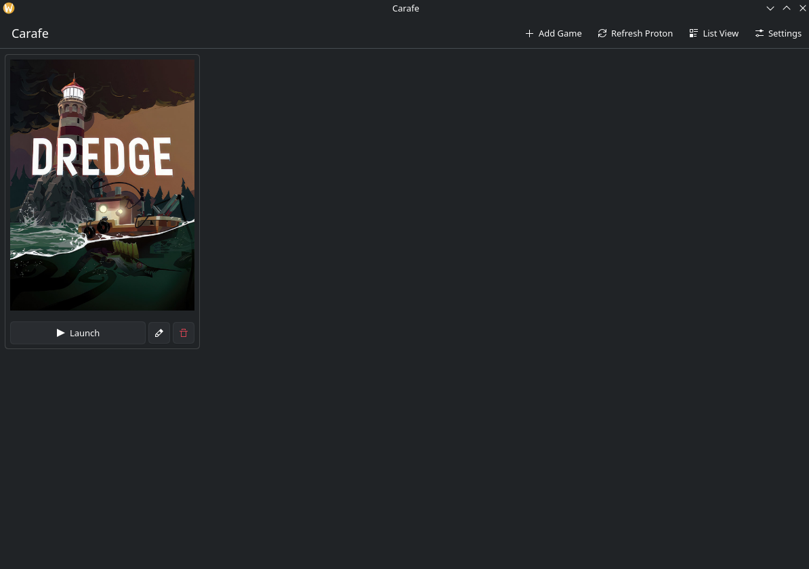
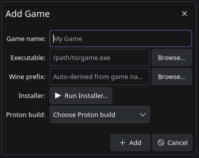

# Carafe

A KDE Plasma-native game launcher for Windows games via Proton/UMU. Built with Qt 6.6+ and Kirigami.

<table>
  <tr>
    <td></td>
    <td></td>
  </tr>
</table>

## Build

This project supports a `just` workflow for debug/release configuration, building, and installing.

### Release

```bash
just configure release
just build release
sudo just install release
```

### Debug

```bash
just configure
just build
./build/debug/bin/carafe
```

### Direct CMake

```bash
cmake -B build -DCMAKE_C_COMPILER=clang -DCMAKE_CXX_COMPILER=clang++
cmake --build build
./build/bin/carafe
```

Dependencies: CMake 4.3+, Clang, `openmp` (LLVM OpenMP runtime, required by Kirigami when building with Clang), Qt 6.6+, KF6 (Kirigami, CoreAddons), KF6 Wallet (optional), `icoutils` (optional), `umu-launcher` (optional).

Install system-wide with `sudo cmake --install build/release` or `sudo just install release`.

## Data

- Library: `~/.local/share/io.marlonn.carafe/library.json`
- Prefixes: `~/carafe/prefixes/<game-slug>/`

## Packaging

- Arch: `cd packaging/arch && makepkg -si`
